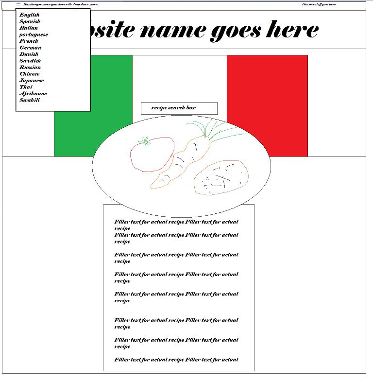
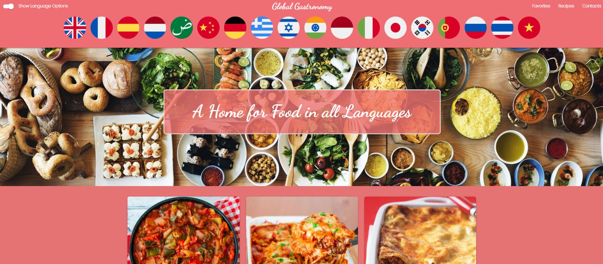
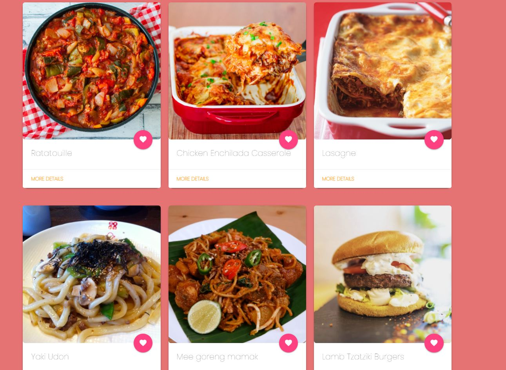
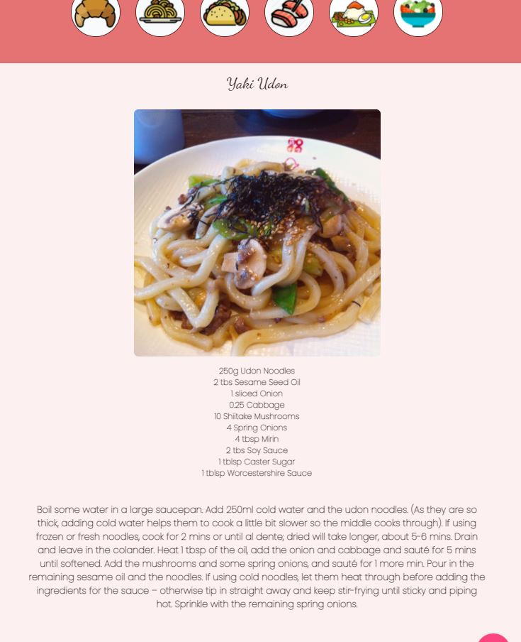
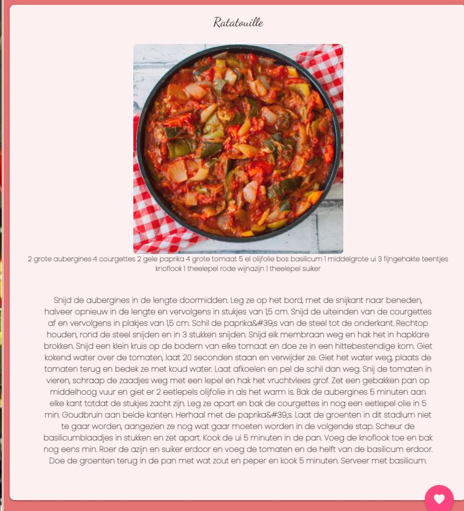

# Recipe-with-translator
<br>


 ## Links
  
  * <a href="https://tmaxey201.github.io/Recipe-with-translator/index.html">Global Gastronomy</a>

  * <a href="https://github.com/Tmaxey201/Recipe-with-translator"> Github Repo</a>


<br>

## My Role In This Project

I was tasked to create the entire front end design and interface using HTML, Materalize.CSS, Pure CSS, and Javascript.
This was the first time I used a CSS framework and I learned quite a bit from the entire process. 

# Find Recipes and Translate the Page Into Different Languages 
 

## GLOBAL GASTRONOMY
A web application for users to search through a recipe database and translate the webpage and recipe that is displayed into different languages.  

For those who miss home, or anyone who wants to expand their cultural horizon, you can find that authentic lasagna that taste just like Nonna's and have it displayed in Italian as if she was reading it to you. 


## User Story
```
AS A hungry website user
I WANT to search recipes that are presented in different languages 
SO THAT I can create a meal by reading the recipe
```

## Acceptance Criteria
```
GIVEN a recipe website with translation options
WHEN I click on the translation buttons
THEN the webpage is translated into that language
GIVEN a recipe website with search options
When I search for a recipe
Then I am presented with a selection of options based on the input
When I view the options
Then I am presented with images, discriptions, and different options to chose from
When I am exploring the page, I also have the ability to translate it into any language at any time 
```
## Mock-Up

The following image shows our initial idea of the web application's appearance and functionality:

 

## APIs to be used

* For obtaining the recipes

* https://www.themealdb.com/api.php

* For translating the recipes

* https://cloud.google.com/translate
 


## Rough breakdown of tasks 

* Thomas - front-end and project manager

* Naomi - back-end translations

* Alexis - back-end recipes

## Final Website Overview

The following images display the final website application's appearance and functionality:



* ^^This is the main page, different national flags are immediately shown on page load in order for users to select which language they want the website to be translated to. You can also toggle the display of the flags. 



* ^^Six recipes are shown here to choose from, once a user has decided what they would like to cook, they click on more details to get the recipe ingredients and instructions. 



* ^^A clip of one of the detailed recipes, all recipes initially load in the english language. You have the option to switch between recipes with food icons at the top. National flags are also displayed on this page in order to translate the recipe to the selected language.



 * ^^This image shows the detailed recipe card translated to a different language.

 ## Future Development
 
 * Translate from a special character based language back to an alphabetical character based language without errors

 * Change units of measurement from imperial to metric with translations

 * After translation, still display ingredients as a list.

 * Implement the favorite recipes function to easily access those recipes

 * Overall access to more recipes from the api

 * Implement multiple recipes display from various countries, instead of a selected six specific recipes

 * Implement a search function for recipes

 ## Links
  
  * <a href="https://tmaxey201.github.io/Recipe-with-translator/index.html">Global Gastronomy</a>

  * <a href="https://github.com/Tmaxey201/Recipe-with-translator"> Github Repo</a>


